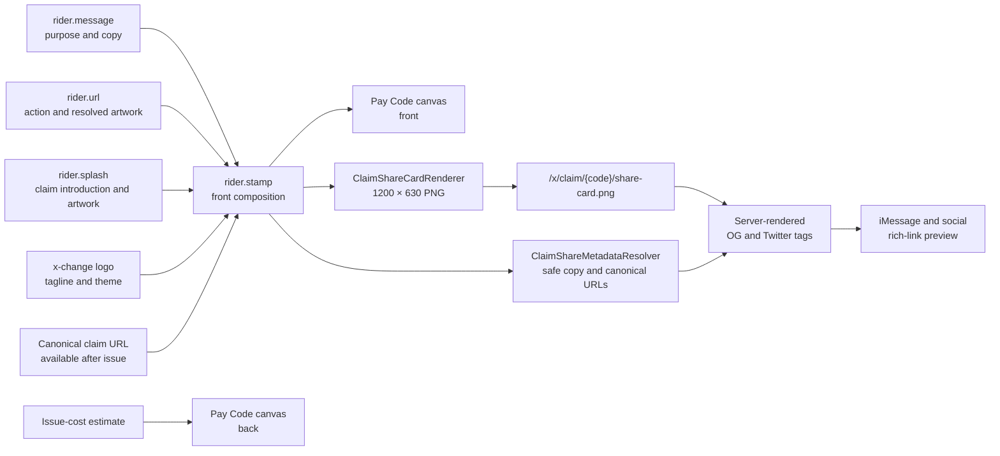

# Create Pay Code UI/UX Contract

## Purpose

`/x/cockpit/quick-generate` is the ordinary Account holder’s Pay Code
designer. The route name and internal `QuickGenerate` implementation remain
stable for compatibility, but the product language is **Create Pay Code**.

The intended journey is:

```text
Create → Design → Review → Issue
```

The page must help a person who understands ordinary mobile applications
create a Pay Code without first learning voucher DTOs, mutation handoffs, or
provider internals.

## Primary experience

The first working surface contains:

- amount;
- recipient;
- purpose; and
- a live front/back Pay Code canvas.

The canvas is a digital credential preview, not a bank cheque. It must not use
MICR lines, account routing, signature lines, or “pay to the order of”
language.

The front prioritizes capability, value, recipient, purpose, and Pay Code
identity. The back explains the claim journey. Before issuance it uses an
explicitly non-scannable placeholder. After issuance it may display the real
claim credential.

## Rider Stamp and the Pay Code front

**Rider Stamp** is the package’s composition instruction for the front of a
Pay Code. It is not a fourth content experience and it does not compete with
the canvas.

- `rider.message` supplies purpose or recipient-facing copy;
- `rider.url` supplies an action destination and, when safely resolved, an
  artwork candidate;
- `rider.splash` supplies the separate pre-claim introduction and may also
  supply an artwork or copy candidate; and
- `rider.stamp` chooses how those candidates, x-change branding, and the claim
  marker are composed on the front.



The full Pay Code canvas is the only complete Stamp preview. The Rider URL
editor may show compact resolved-artwork status, and the Rider Splash editor
may show the isolated **Claim Splash Preview**, but neither renders a second
full Pay Code front.

The Stamp version 2 composition fields independently select:

- artwork source: x-change, Rider URL, Rider Splash, or none;
- artwork treatment: automatic, artwork, or text;
- copy source: best available, Rider Message, Rider URL, Rider Splash, custom,
  or none;
- logo and tagline visibility;
- claim marker: QR, Pay Code text, both, or none; and
- claim-marker position.

Version 1 Stamp payloads remain readable and are normalized into version 2
defaults. `rider.og_source` remains a compatibility mirror; it is not the
authoritative composition field.

Arbitrary remote pages are never embedded in the canvas. URL artwork is
resolved through the package-owned preview boundary. Splash markup remains
sandboxed, and its visible copy is composed by the canvas so headings are not
painted twice.

Before issuance, a requested QR position contains a dashed, explicitly
non-scannable placeholder. Successful issuance renders the QR on the server
from the canonical URL returned by `GeneratePayCode`. User-entered Rider
content cannot set or replace the encoded destination.

## Shared claim-link metadata

`/x/claim/{code}` renders its share metadata in the first HTML response. Link
preview crawlers do not need to execute Vue, hydrate Inertia, or inspect the
embedded page props.

`ClaimShareMetadataResolverContract` is the replacement boundary. The default
resolver maps Rider Stamp instructions into:

- a safe title and description;
- the canonical claim URL;
- the x-change site name;
- and the canonical package-owned share-card URL.

`ClaimShareCardRendererContract` is the separate image replacement boundary.
The default renderer generates a deterministic 1200 × 630 PNG from the stored
Rider Stamp composition. It may use safely resolved, allow-listed Rider URL
artwork as an input, but the external image is never published as `og:image`.
The canonical image is:

```text
/x/claim/{code}/share-card.png
```

Artwork fallback follows the Stamp—not the availability of unrelated Rider
content:

```text
Stamp selects Rider URL
    resolved URL artwork → compose it into the card
    unavailable artwork  → compose x-change branding
    never                → fall through to Rider Splash

Stamp selects Rider Splash
    safely renderable Splash artwork → compose it into the card
    otherwise                         → compose x-change branding
```

The local renderer accepts embedded `data:image` artwork from an explicitly
selected Splash. It does not server-fetch arbitrary image URLs found in Splash
HTML. A future remote-Splash adapter must apply the same HTTPS host allowlist,
redirect, MIME, byte-limit, and timeout controls as the Rider URL resolver.

The server never publishes a canvas data URI, raw Rider URL artwork, or raw
Rider Splash artwork as `og:image`. HTML copy is reduced to plain text and
Blade escapes every metadata value. The PNG response is stateless, throttled,
publicly cacheable, ETag-addressable, and marked `nosniff`.

The package-owned claim root view emits Open Graph, Twitter Card, canonical,
description, ordinary title, image MIME type, and 1200 × 630 dimensions. A
future `3neti/og-meta` adapter may replace the renderer and metadata resolver
without changing the public claim or image controllers.

The default presentation may be configured with:

```text
XCHANGE_CLAIM_SHARE_SITE_NAME
XCHANGE_CLAIM_SHARE_DEFAULT_DESCRIPTION
XCHANGE_CLAIM_SHARE_CACHE_TTL_SECONDS
XCHANGE_CLAIM_SHARE_MAXIMUM_ARTWORK_PIXELS
```

A rich-link preview requires the receiving crawler or device to reach and
trust both the claim URL and the share-card URL. Production sharing therefore
requires public HTTPS. A Herd `.test` address may work on a locally connected
and trusting device, but it is not a production-reachable address.

## Starting Point

Every design begins from one compact control:

- **Blank Pay Code** removes optional instructions and clears amount, recipient,
  and purpose;
- **Repeat Last Design** restores the last successful reusable instruction
  blueprint, but never restores the recipient, feedback destinations,
  validation secrets, issuer/account identifiers, or absolute dates;
- **Choose Template** opens one responsive picker containing package-owned
  recommended templates and the Account holder’s **My Templates**; and
- **Save As Template** stores the current reusable design for that Account
  holder.

The old **Start Fresh** action must not reapply the currently selected product
profile. Blank means blank.

Recommended templates and personal templates are different concepts. A
recommended template is a package-owned issuance profile. A personal template
is an owner-scoped reusable blueprint whose `base_template_key` continues to
identify the recommended profile used by the issuance compiler.

When a personal template is used, the issued instruction metadata records its
reference and name under `metadata.custom.cockpit.saved_template`. It does not
replace `template_key` and it does not create or mutate campaign context.

## Personal template safety

Personal templates are package-owned database records. Their instruction
blueprints use Laravel’s encrypted array cast and are queried through the
authenticated owner relationship.

Before storage, x-change removes:

- recipient identifiers and recipient validation values;
- feedback email, mobile, and webhook destinations;
- validation secrets;
- absolute start and expiry dates;
- issuer and Account identifiers;
- campaign context;
- prior saved-template provenance;
- idempotency keys; and
- generated Pay Code values.

The user explicitly chooses whether amount and purpose are reusable. Amount is
excluded by default; purpose is included by default. Server-side sanitization
is authoritative even when the browser already removed those fields.

## Progressive disclosure

Claim inputs, verification, feedback, riders, slicing, settlement, execution,
metadata, and other advanced controls belong under **Instructions and
safeguards**.

The design-status checklist and DTO coverage are secondary disclosures. They
must not compete with the essentials or live canvas.

## Review and issue

The canvas, **Instructions and safeguards**, and collapsed Engineering Preview
are the three review levels. Additional design-status and review-summary cards
must not repeat the same facts.

The primary action is **Issue Pay Code**. While processing it reads
**Issuing Pay Code…**. Success reads **Pay Code issued** and keeps the issued
code visually prominent. **Edit Front** beside the primary action opens the
Rider and Front Design controls without turning them into a competing primary
surface.

The existing issuance compiler, authorization, validation, idempotency,
pricing, funding, journal, action, feedback, campaign, provider, and Treasury
boundaries remain authoritative. This UI does not create a parallel issuance
runtime.

## Technical boundary

Ordinary users must not see:

- `GeneratePayCode`;
- DTO coverage as a primary surface;
- mutation-route provenance;
- architecture history;
- raw payloads; or
- runtime gate diagnostics.

Technical diagnostics remain package-owned and testable, but they are omitted
from the ordinary page. If a future privileged diagnostics surface reuses
them, authorization must happen in the server read model; hiding DOM with CSS
is not authorization.

## Responsive behavior

Desktop presents essentials and the credential side by side, with the canvas
sticky while editing. Narrow layouts stack the form and canvas, preserve the
front/back control, avoid horizontal scrolling, and keep all touch controls at
comfortable sizes.

## Acceptance

Acceptance requires:

- reactive amount, recipient, purpose, capability, expiry, and safeguard
  presentation;
- deterministic Blank, Repeat Last, recommended-template, and personal-template
  behavior;
- encrypted, owner-scoped personal-template persistence;
- recipient and one-time-data removal from reusable blueprints;
- no fake scannable QR before issuance;
- a server-rendered canonical claim QR after issuance;
- server-rendered OG and Twitter metadata on the canonical claim route;
- a canonical package-owned 1200 × 630 PNG share-card URL rather than a raw
  Rider image or data URI;
- URL-artwork failure falls back to x-change branding and never to unrelated
  Rider Splash content;
- public cache headers, deterministic ETag, conditional 304, and `nosniff` on
  the share-card response;
- no Rider-controlled claim destination or remote-page embedding;
- one complete front preview, with Claim Splash kept visibly separate;
- Rider Stamp version 1 read compatibility and version 2 submission;
- unchanged sanitized issuance payload semantics;
- structured validation errors;
- duplicate-submit prevention;
- dark-mode parity;
- focused Vue and architecture tests;
- successful asset drift diagnostics and production build; and
- desktop and narrow-layout browser inspection when browser control supports
  the required viewport.
